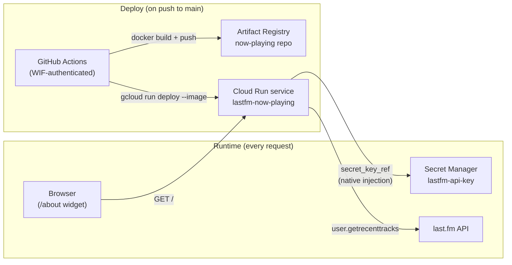

# elliotx-website-apps

Small backend apps that support [elliotx.com](https://elliotx.com), each deployed as its own container on Cloud Run. This repo is meant to hold several of these over time — one folder per app, sharing a common deploy pattern rather than each reinventing it.

The first app here, `last-fm/now-playing`, is documented below in full as a worked example: what it does, how it's built, how it deploys, and how the pieces fit together — so you can either understand it or copy the pattern for something of your own.

## Structure

```
<integration>/<app-name>/     # e.g. last-fm/now-playing/ — one folder per app
.github/
  dependabot.yml                # one npm + docker entry per app, plus github-actions
  workflows/
    deploy-app.yml               # reusable: build, scan, push to GAR, deploy to Cloud Run
    lint-app.yml                 # reusable: format/lint/typecheck/audit
    <app-name>.yml                # thin per-app caller — lint on PR, deploy on push to main
    codeql.yml                   # repo-wide, not per-app
    dependency-review.yml        # repo-wide, not per-app
```

Each app folder is a self-contained Node/TypeScript project with its own `package.json`, `package-lock.json`, and `Dockerfile` — deliberately *not* an npm workspace. That was tried first and reverted: workspaces hoist `node_modules`/the lockfile to the repo root, which breaks a per-app-folder Docker build context. Revisit that decision only once a second app creates a real shared-tooling need.

Infra (GCP resources, IAM) for these apps lives in a **separate** repo, `elliotx-website-terraform`, one subfolder per app — see [Infrastructure](#infrastructure) below.

## Worked example: `last-fm/now-playing`

Returns the currently-playing (or most recently played) track from [last.fm](https://last.fm) as JSON, for the "Now playing" widget on elliotx.com's `/about` page.

```
GET https://lastfm-now-playing-ei7ug2a2za-uw.a.run.app/

{
  "isPlaying": true,
  "track": "Ms. Tundra",
  "artist": "Ne-Yo",
  "album": "Ms. Tundra",
  "albumArt": "https://lastfm-img.freetls.fastly.net/i/u/174s/....jpg",
  "url": "https://www.last.fm/music/Ne-Yo/_/Ms.+Tundra"
}
```

### Why it's a Cloud Run service, not a Cloud Function

The obvious-looking option is a small serverless function. That was actually the first implementation — but it doesn't fit a CI/CD flow where GitHub Actions itself builds and pushes an image: Cloud Functions v2 always rebuilds its own container from source via a hidden, Google-managed Cloud Build pipeline on every deploy, and can't be pointed at an image you already built and pushed yourself.

A plain Cloud Run **service** does exactly that: you build an image anywhere, push it to a registry, and tell Cloud Run "run this." That's the model here — GitHub Actions builds the image and pushes it to Artifact Registry (GAR); Cloud Run just runs whatever image is there.

### Architecture



No long-lived credentials anywhere in this pipeline:

- **GitHub → GCP**: Workload Identity Federation (WIF). GitHub Actions presents its OIDC token; GCP trusts it for this exact repo and exchanges it for short-lived access as a scoped service account. No service account key ever leaves GCP.
- **API key → app**: Cloud Run's native Secret Manager integration mounts the secret as an env var at the *platform* level — the app just reads `process.env.LASTFM_API_KEY` like any other env var. There's no Secret Manager SDK call in the app code, and the key is never in the container image, in git, or in CI logs.

### App code

Plain Node/TypeScript, zero runtime dependencies (Node's built-in `http` and global `fetch` are enough for one route):

- `src/index.ts` — HTTP server, CORS headers (public read-only data — safe to allow any origin), routes `GET /` to the handler.
- `src/lastfm.ts` — calls last.fm's `user.getrecenttracks`, maps the response to the JSON shape above, with a 20s in-memory cache (the endpoint is public and unauthenticated, so a short cache absorbs both last.fm's own rate limits and any burst of visitor traffic).

Environment variables:

| Variable          | Where it comes from                                             | Secret? |
| ------------------ | ----------------------------------------------------------------- | ------- |
| `LASTFM_API_KEY`   | Cloud Run, injected from Secret Manager (`secret_key_ref`)        | Yes     |
| `LASTFM_USERNAME`  | Cloud Run, plain env var (set via Terraform)                      | No — public last.fm data, just kept out of source so it's not hardcoded |
| `PORT`             | Cloud Run sets this automatically                                  | —       |

### Dockerfile

Two-stage build — `npm install && npm run build` (tsc) in a builder stage, then just the compiled `dist/` copied into a clean `node:24-slim` (Active LTS) runtime stage. No dependencies to install in the final stage since there are none at runtime.

### CI/CD

- **`.github/workflows/deploy-app.yml`** — reusable (`workflow_call`), parameterized by app path, service name, region, GAR repo, WIF provider, and deploy service account. Authenticates via WIF, builds the image, scans it (Trivy — see below), pushes to GAR, then `gcloud run deploy --image=...`.
- **`.github/workflows/last-fm-now-playing.yml`** — a thin caller, path-filtered to `last-fm/now-playing/**`: on a PR it calls `lint-app.yml`; on push to `main` it calls `deploy-app.yml` with this app's specific values. This is the file you'd copy (not either reusable workflow) to add a new app.

### Linting and security

Everything below is repo-wide policy, not something specific to this one app — the same checks apply automatically to any new app folder that follows the pattern.

| Check | Where | Runs |
| --- | --- | --- |
| Format (Prettier), lint (ESLint), typecheck (`tsc --noEmit`) | `lint-app.yml`, called per-app | Every PR touching that app |
| `npm audit` (fails on high/critical) | `lint-app.yml` | Every PR touching that app |
| Container image scan (Trivy, fails on high/critical, fixed vulnerabilities only) | `deploy-app.yml`, after build, before push | Every deploy — a vulnerable image never reaches GAR or Cloud Run |
| [CodeQL](https://codeql.github.com/) static analysis | `codeql.yml` | Push/PR to `main`, plus a weekly scheduled scan so newly-disclosed CVEs in unchanged code still get caught |
| [Dependency review](https://docs.github.com/en/code-security/supply-chain-security/understanding-your-software-supply-chain/about-dependency-review) | `dependency-review.yml` | Every PR — flags newly-introduced vulnerable dependencies in the diff itself |
| [Dependabot](https://docs.github.com/en/code-security/dependabot) version updates | `dependabot.yml` | Weekly, opens PRs for outdated npm packages, base Docker image, and GitHub Actions versions |

A new app's own `package.json` needs `format:check`, `lint`, and `typecheck` npm scripts for `lint-app.yml` to call — copy `last-fm/now-playing`'s `eslint.config.mjs`, `.prettierrc.json`, and `package.json` scripts as the starting point.

### Infrastructure

Provisioned by Terraform in the separate `elliotx-website-terraform` repo, under `last-fm-now-playing/`:

- `google_cloud_run_v2_service` (via a reusable `modules/cloud-run-service` module) — bootstrapped with Google's public placeholder image so the very first `terraform apply` succeeds before any real image has ever been pushed; `lifecycle.ignore_changes` on the image field so CI's real deploys aren't reverted the next time Terraform plans.
- A shared Workload Identity Pool for the whole `elliotx-website-apps` repo (`modules/github-oidc-pool`, created once), plus one narrowly-scoped deploy service account per app (`modules/github-ci-service-account`) bound to that shared pool. WIF trust is repo-scoped, not path-scoped — a pool per app doesn't scale once a repo holds several of them, so this app's service account (`lastfm-now-playing-ci@...`) is just one of potentially many trusting the same pool.
- A dedicated runtime service account with `secretAccessor` on exactly one secret — nothing project-wide.
- A Secret Manager secret container for the API key (Terraform manages the container, never the value — the key itself is set out-of-band via `gcloud secrets versions add`, so it's never in state or in this git history).

### Local development

```bash
cd last-fm/now-playing
npm install
npm run build
LASTFM_API_KEY=... LASTFM_USERNAME=... PORT=8080 node dist/index.js
```

Or build and run the exact image CI produces:

```bash
docker build -t now-playing-local .
docker run -p 8080:8080 -e LASTFM_API_KEY=... -e LASTFM_USERNAME=... now-playing-local
```

## Adding a new app

1. New folder: `<integration>/<app-name>/` — self-contained `package.json`, `Dockerfile`, own lockfile, plus `eslint.config.mjs` and `.prettierrc.json` copied from `last-fm/now-playing`.
2. Copy `last-fm-now-playing.yml` as `<app-name>.yml`, update the path filter and the `with:` inputs (service name, GAR repo, deploy service account) — this one file wires up both lint-on-PR and deploy-on-push.
3. Add a `package-ecosystem: npm` and a `package-ecosystem: docker` entry for the new app's directory in `.github/dependabot.yml`. CodeQL and dependency review are already repo-wide — nothing to add there.
4. In `elliotx-website-terraform`, add a new subfolder (own Terraform state, matching the "keep infra separate" convention) that calls `modules/cloud-run-service` and `modules/github-ci-service-account` — pointing at the *existing* shared WIF pool by name rather than creating a new one.
5. First `terraform apply` stands up the service on a placeholder image; the first push to the new app's folder replaces it with the real thing.
